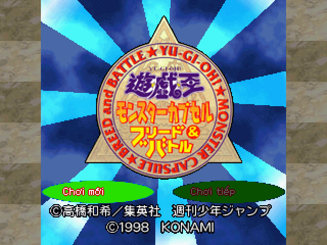
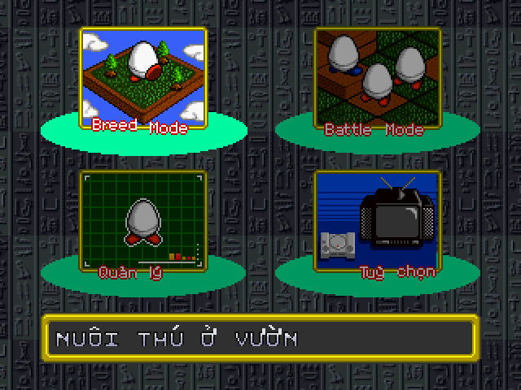
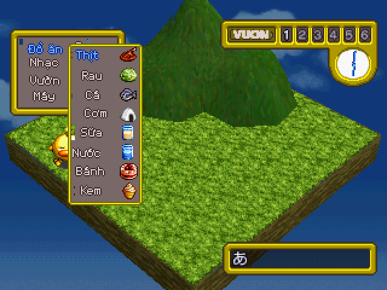
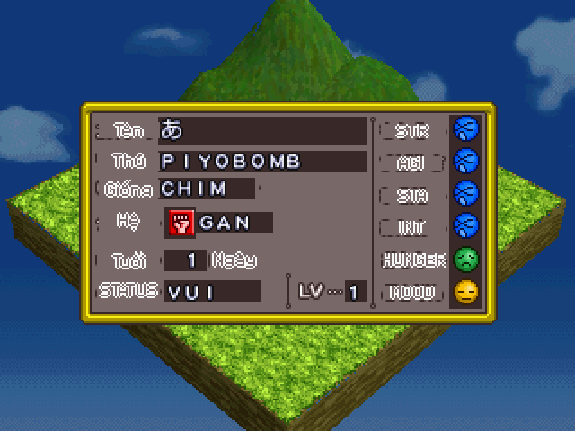
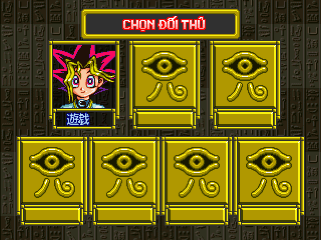
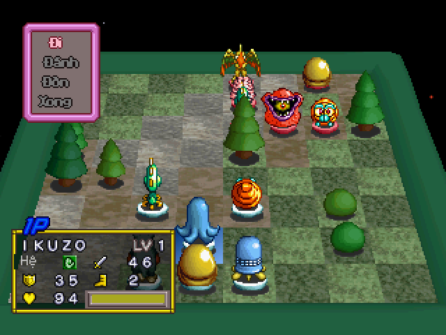

# Yu-Gi-Oh! Monster Capsule Breed & Battle — bản dịch tiếng Việt

Bản vá (patch) Việt hoá cho trò chơi PlayStation 1 *Yu-Gi-Oh! Monster Capsule
Breed & Battle* (Konami, 1998, mã đĩa **SLPM-86096**, bản Nhật).

Đây là dự án của người hâm mộ, không liên quan tới Konami. Gói này **không
chứa** đĩa gốc hay bất kỳ dữ liệu nào của trò chơi. Bạn cần có ảnh đĩa gốc của
chính mình; bản vá chỉ ghi phần chữ tiếng Việt, phông chữ và vài byte mã điều
chỉnh lên ảnh đĩa đó.

## Tóm tắt 5 bước

1. Chọn **một** trong ba bản (bảng ngay dưới).
2. Tải file `.ppf` của bản đó (mục 0).
3. Kiểm đĩa gốc Nhật của bạn có SHA-256 bắt đầu bằng `51c38225` (mục 1–2).
4. Áp file `.ppf` lên **một bản sao của đĩa gốc** (mục 3 hoặc 4).
5. Kiểm SHA-256 đĩa ra theo đúng dòng của bản đã chọn (mục 5), rồi mở file
   `.cue` bằng giả lập.

## Chọn bản

Có **ba bản**, cả ba đều là tiếng Việt đầy đủ như nhau. Chỉ khác độ mạnh của
thú phe máy (CPU) khi đấu ở **Battle mode**:

| Bản | File cần tải | Dành cho | SHA-256 đĩa ra bắt đầu bằng |
|---|---|---|---|
| **1. Bản dịch thuần** | `yugioh-mcbb-vi.ppf` | Chơi lần đầu, muốn giống bản gốc. **Không biết chọn gì thì chọn bản này.** | `68d403c2` |
| **2. Bản dịch + mod CPU 25%** | `yugioh-mcbb-vi-cpu25.ppf` | Đã chơi, thấy bản gốc hơi dễ | `40450f2d` |
| **3. Bản dịch + mod CPU 50%** | `yugioh-mcbb-vi-cpu50.ppf` | Muốn thử thách thật sự | `b858d3a0` |

Quy tắc quan trọng, tránh nhầm:

- Mỗi file `.ppf` là **một bản vá trọn gói** (đã gồm tiếng Việt). **Chỉ áp một
  file**, không áp bản thuần rồi áp thêm file mod.
- **Luôn áp lên đĩa gốc Nhật chưa sửa**, không áp lên đĩa đã vá trước đó. Muốn
  đổi bản thì lấy lại bản sao mới của đĩa gốc rồi áp file khác.
- Nên đặt tên đĩa ra theo bản để khỏi lẫn, ví dụ `Yu-Gi-Oh! Monster Capsule Breed & Battle (VN).bin`,
  `Yu-Gi-Oh! Monster Capsule Breed & Battle (VN)mod25.bin`, `Yu-Gi-Oh! Monster Capsule Breed & Battle (VN)mod50.bin`.

Chi tiết mod CPU ở mục 7b.

Các file khác trong gói:

| File | Dùng để |
|---|---|
| `apply_patch.py` | Trình áp vá bằng Python, tự kiểm SHA-256 trước và sau, tự tạo `.cue` (mục 4) |
| `tao_cue.bat` | Tạo file `.cue` đúng tên cho file `.bin` (kéo thả hoặc nháy đúp, mục 5) |
| `README.md` | Hướng dẫn này |

---

## Hình ảnh

| | |
|---|---|
|  |  |
| Màn tựa: Chơi mới / Chơi tiếp | Menu chọn chế độ |
|  |  |
| Vườn nuôi thú, menu đồ ăn | Bảng chỉ số của thú |
|  |  |
| Chọn đối thủ | Bảng lệnh của quân: Đi / Đánh / Đòn / Xong |

## 0. Tải file về

- **Tải cả gói (dễ nhất):** trên trang repo, bấm nút xanh **Code** →
  **Download ZIP**, rồi giải nén. Bạn có đủ cả ba file `.ppf`, `apply_patch.py`
  và `tao_cue.bat`.
- **Tải riêng từng file:** bấm vào tên file trong danh sách (ví dụ
  `yugioh-mcbb-vi-cpu25.ppf`), rồi bấm nút **tải xuống** (mũi tên ⤓ ở góc phải,
  cạnh nút *Raw*). Đừng dùng chuột phải → "Lưu liên kết": cách đó tải về trang
  web chứ không phải file vá.

Kiểm kích thước sau khi tải: file `.ppf` phải khoảng **420–430 KB**. Nếu chỉ vài
KB hoặc mở ra thấy chữ HTML thì bạn đã tải nhầm trang web, tải lại.

## 1. Chuẩn bị ảnh đĩa gốc

Bạn cần ảnh đĩa dạng **`.bin` + `.cue`** (Mode 2, 2352 byte mỗi sector) của
đĩa Nhật SLPM-86096. Đây là định dạng mà các phần mềm đọc đĩa PS1 phổ biến
(ImgBurn, CDRDAO, Alcohol 120%…) xuất ra khi chọn kiểu "BIN/CUE". Một số lưu ý:

- Ảnh đĩa phải có **đúng một file `.bin`**. Nếu `.cue` của bạn liệt kê nhiều
  file (Track 01, Track 02…), đó là kiểu chia track, không dùng trực tiếp được.
- File `.iso` (2048 byte mỗi sector) **không** dùng được: bản vá tính theo
  sector 2352 byte có mã sửa lỗi.
- Kích thước đúng của `.bin`: **171.500.784 byte** (72.917 sector).

Bản vá được tạo từ đúng một ảnh đĩa; ảnh khác dù "cùng game" cũng có thể lệch
vài byte. Vì vậy phải kiểm SHA-256 trước khi áp.

## 2. Kiểm SHA-256 của ảnh đĩa gốc

SHA-256 là "dấu vân tay" của file: hai file giống nhau từng byte thì ra cùng
một chuỗi 64 ký tự. Ảnh đĩa gốc phải cho ra đúng:

```
51c38225b7e6e4af01f45aa3dd6209412ffb19c1f8569b667d038aca1141a355
```

Cách tính trên từng hệ điều hành (thay `TEN_FILE.bin` bằng tên file của bạn;
nếu đường dẫn có khoảng trắng thì đặt trong dấu ngoặc kép):

**Windows, dùng Command Prompt (cmd):**

```
certutil -hashfile "TEN_FILE.bin" SHA256
```

Mở cmd bằng cách gõ `cmd` vào ô tìm kiếm của Start; dùng lệnh `cd` để vào thư
mục chứa file, hoặc kéo thả file vào cửa sổ cmd để dán đường dẫn. Kết quả hiện
ở dòng thứ hai, có thể có khoảng trắng giữa các cặp ký tự, cứ bỏ khoảng trắng
mà so.

**Windows, dùng PowerShell:**

```
Get-FileHash "TEN_FILE.bin" -Algorithm SHA256
```

Cột `Hash` là kết quả (chữ in hoa, so không phân biệt hoa thường).

**macOS (Terminal):**

```
shasum -a 256 "TEN_FILE.bin"
```

**Linux:**

```
sha256sum "TEN_FILE.bin"
```

File 171 MB nên tính mất vài giây. Chỉ cần so **8 ký tự đầu** là đủ để nhận
ra: đĩa gốc đúng bắt đầu bằng `51c38225`. Nếu khác, xem mục 6.

## 3. Áp vá — cách 1: PPF-O-Matic (Windows, không cần cài gì)

PPF-O-Matic là công cụ nhỏ, miễn phí, chuyên áp bản vá PPF cho đĩa PS1; tìm
"PPF-O-Matic 3" trên các trang lưu trữ công cụ ROM hacking.

1. **Sao chép** file `.bin` gốc ra một bản khác và đổi tên theo bản bạn chọn
   (bảng dưới). PPF-O-Matic sửa thẳng vào file được chọn, nên **luôn giữ lại
   file gốc** không đụng tới.
2. Mở PPF-O-Matic. Ô **ISO file**: chọn bản sao vừa tạo. Ô **Patch**: chọn file
   `.ppf` của đúng bản đó.
3. Bấm **Apply**. Chỉ vài giây, chương trình báo "Successfully patched".
   Ô mô tả của PPF-O-Matic hiện tên bản vá (cột cuối bảng dưới); đúng tên thì
   bạn đã chọn đúng file.
4. Tạo file `.cue` và kiểm kết quả theo mục 5.

| Bản | Tên bản sao nên đặt | Ô **Patch** chọn | PPF-O-Matic hiện mô tả |
|---|---|---|---|
| 1. Bản dịch thuần | `Yu-Gi-Oh! Monster Capsule Breed & Battle (VN).bin` | `yugioh-mcbb-vi.ppf` | `... ban dich tieng Viet` |
| 2. Mod CPU 25% | `Yu-Gi-Oh! Monster Capsule Breed & Battle (VN)mod25.bin` | `yugioh-mcbb-vi-cpu25.ppf` | `... tieng Viet + CPU +25` |
| 3. Mod CPU 50% | `Yu-Gi-Oh! Monster Capsule Breed & Battle (VN)mod50.bin` | `yugioh-mcbb-vi-cpu50.ppf` | `... tieng Viet + CPU +50` |

Muốn có nhiều bản cùng lúc thì làm lại từ bước 1 cho mỗi bản, **mỗi lần một
bản sao mới từ đĩa gốc**.

## 4. Áp vá — cách 2: Python (Windows, macOS, Linux)

Cần Python 3 (tải từ python.org; trên Windows khi cài nhớ tick "Add Python to
PATH"). Cách này **không sửa** file gốc mà tạo file mới, tự kiểm SHA-256 và tự
tạo luôn file `.cue`.

1. Đặt `apply_patch.py`, file `.ppf` đã chọn và file `.bin` gốc vào cùng một
   thư mục.
2. Mở cửa sổ lệnh tại thư mục đó. Windows: mở thư mục trong File Explorer, bấm
   vào thanh địa chỉ, gõ `cmd` rồi Enter. macOS/Linux: mở Terminal tại thư mục.
3. Chạy **đúng một** lệnh theo bản bạn chọn (thay `TEN_FILE_GOC.bin` bằng tên
   file gốc của bạn, giữ nguyên dấu ngoặc kép):

**Bản 1 — dịch thuần:**

```
python apply_patch.py "TEN_FILE_GOC.bin" yugioh-mcbb-vi.ppf "Yu-Gi-Oh! Monster Capsule Breed & Battle (VN).bin"
```

**Bản 2 — dịch + mod CPU 25%:**

```
python apply_patch.py "TEN_FILE_GOC.bin" yugioh-mcbb-vi-cpu25.ppf "Yu-Gi-Oh! Monster Capsule Breed & Battle (VN)mod25.bin"
```

**Bản 3 — dịch + mod CPU 50%:**

```
python apply_patch.py "TEN_FILE_GOC.bin" yugioh-mcbb-vi-cpu50.ppf "Yu-Gi-Oh! Monster Capsule Breed & Battle (VN)mod50.bin"
```

Trên macOS/Linux nếu báo không có `python` thì dùng `python3`.

4. Đọc dòng cuối cùng mà lệnh in ra:

| Dòng cuối in ra | Nghĩa |
|---|---|
| `KHOP ban phat hanh: ban tieng Viet` | Xong bản 1, đĩa đúng |
| `KHOP ban phat hanh: tieng Viet + mod CPU +25%` | Xong bản 2, đĩa đúng |
| `KHOP ban phat hanh: tieng Viet + mod CPU +50%` | Xong bản 3, đĩa đúng |
| `Dia goc khong dung (sha256 khong khop)...` | Đĩa gốc sai, chưa ghi gì; xem mục 6 |
| `KHONG KHOP - dia goc co the khac ban chuan` | Đĩa ra sai; xem mục 6 |
| `Khong phai file PPF3.` | File `.ppf` tải hỏng (thường là tải nhầm trang web); tải lại theo mục 0 |

Nếu tên bản ở dòng `KHOP` không phải bản bạn định chọn thì bạn đã gõ nhầm tên
file `.ppf`; chạy lại lệnh đúng.

Cách này đã tạo sẵn file `.cue` cùng tên cạnh file `.bin` (ví dụ
`Yu-Gi-Oh! Monster Capsule Breed & Battle (VN)mod25.cue`), bỏ qua phần tạo `.cue` ở mục 5.

## 5. Kiểm kết quả

Tính SHA-256 của file đã vá (cùng cách ở mục 2) và so với **đúng dòng của bản
bạn đã áp**:

| Bản | SHA-256 đĩa ra |
|---|---|
| 1. `yugioh-mcbb-vi.ppf` | `68d403c2cc34d339d93cc5a9851733792ae5462405b3cbfe9797eefbc127ff5d` |
| 2. `yugioh-mcbb-vi-cpu25.ppf` | `40450f2d479c4e6197b470128181d80f532b0a8542e21ed614b5407660b99176` |
| 3. `yugioh-mcbb-vi-cpu50.ppf` | `b858d3a0418d1ee85ea8d08f9e1d47d919b2d0da80c5c30fae5c5c7ca1597b5d` |

Chỉ cần so 8 ký tự đầu. Đúng chuỗi này thì file của bạn giống từng byte với bản
đã được kiểm thử; mọi lỗi nếu có sẽ không phải do bước áp vá. Ra chuỗi của một
bản **khác** trong bảng nghĩa là bạn đã chọn nhầm file `.ppf`; đĩa vẫn dùng
được, chỉ là bản khác.

Nếu áp bằng PPF-O-Matic thì cần thêm file `.cue` cho đĩa mới (cách Python đã
tự tạo sẵn). Nhanh nhất: **kéo thả file `.bin` đã vá lên `tao_cue.bat`**, hoặc
chép `tao_cue.bat` vào cùng thư mục rồi nháy đúp — nó tạo `.cue` đúng tên cho
mọi file `.bin` ở đó. Muốn làm tay thì tạo file văn bản cùng tên với file
`.bin` nhưng đuôi `.cue` (ví dụ `Yu-Gi-Oh! Monster Capsule Breed & Battle (VN)mod50.cue`), nội dung ba dòng,
dòng đầu ghi **đúng tên file `.bin`** của bạn:

```
FILE "Yu-Gi-Oh! Monster Capsule Breed & Battle (VN)mod50.bin" BINARY
  TRACK 01 MODE2/2352
    INDEX 01 00:00:00
```

## 6. Khi SHA-256 không khớp

- **Ảnh gốc ra chuỗi khác `51c38225…`:** ảnh đĩa của bạn không phải bản mà bản
  vá được tạo từ đó. Nguyên nhân hay gặp: đọc đĩa ra kiểu `.iso` 2048 byte
  (kích thước sẽ nhỏ hơn 171 MB nhiều), đọc thiếu hoặc thừa sector cuối, đĩa
  thuộc bản in khác, hoặc file từng bị áp một bản vá khác. Cách chắc nhất là
  đọc lại từ đĩa thật bằng ImgBurn ở chế độ BIN/CUE. Bản vá áp lên ảnh sai vẫn
  chạy được phần lớn, nhưng có thể lỗi ở chỗ không lường trước.
- **Ảnh đã vá không khớp dòng tương ứng trong bảng mục 5:** bạn đã áp lên ảnh gốc sai (xem trên),
  hoặc áp lên một file đã vá trước đó (ví dụ áp file mod lên đĩa bản thuần).
  Làm lại từ một bản sao mới của đĩa gốc, chỉ áp một file `.ppf`.

## 7. Chạy trên giả lập

Mở file **`.cue`** (không phải `.bin`) bằng giả lập. Đã thử trên PCSX-Redux;
DuckStation, ePSXe, Mednafen/Beetle PSX đều đọc được BIN/CUE.

- Thẻ nhớ (save trong game) dùng bình thường, kể cả thẻ từ bản Nhật.
- **Không nạp save state** (lưu nhanh của giả lập, kiểu F5/F7) được tạo trên
  bản Nhật hay bản dịch cũ: save state giữ nguyên toàn bộ bộ nhớ lúc lưu, nên
  vẫn hiện chữ cũ dù đĩa mới đã đúng. Vào game bằng "Chơi tiếp" từ thẻ nhớ.
- Nếu từng chơi các bản dịch thử nghiệm phát hành trước tháng 9/2026, thú
  trong save cũ có thể mang chỉ số bị lỗi từ bản đó; nên nuôi vườn mới.
- Màn đặt tên thú: trang đầu là bảng chữ Việt (A–Z, Á Â Đ Í Ó Ư, số, dấu câu),
  hai trang Kana và ABC của bản gốc vẫn còn.

## 7b. Bản mod CPU mạnh hơn (+25% / +50%)

Hai bản mod tăng **HP, công, thủ** của mọi thú phe CPU trong **Battle mode**,
cho ai thấy bản gốc quá dễ:

- **Không** tăng bước di chuyển.
- **Không** đụng tới thú của người chơi, Breed mode hay file save.
- Chỉ số vượt 255 được chặn ở 255 (làm tròn xuống).

| Bản | Hệ số | Ví dụ BARDON phe CPU (HP / công / thủ) |
|---|---|---|
| 1. Bản dịch thuần | ×1 | 99 / 91 / 13 |
| 2. Mod +25% | ×1,25 | 123 / 113 / 16 |
| 3. Mod +50% | ×1,5 | 148 / 136 / 19 |

Muốn đổi mức thì áp lại file PPF khác lên **bản sao mới của đĩa gốc**, không áp
chồng lên đĩa đã vá. Thẻ nhớ dùng chung được giữa ba bản (mod không đụng tới
save), nhưng **save state** của giả lập thì không: save state tạo trên bản này
nạp vào bản khác sẽ mang theo chỉ số cũ. Chỉ số mới áp khi thú CPU được đặt
lên bàn lúc bắt đầu trận, áp dụng cho cả hai kiểu xếp quân (tuỳ chọn **Tự xếp**
ON hay OFF). Bản +50% đã chạy thử trong giả lập với cả hai kiểu xếp quân (chỉ
số đúng, mỗi thú CPU nhân đúng một lần, trận chạy bình thường); chưa thử trên
máy PS1 thật.

> **Cập nhật 29/9/2026:**
> - Mod CPU: các file mod tải trước 28/9 chỉ buff CPU khi **Tự xếp = ON**.
>   Tuỳ chọn này được lưu trong save, nên chơi tiếp từ thẻ nhớ với Tự xếp = OFF
>   thì CPU không mạnh lên. Nay buff với cả hai kiểu xếp quân.
> - Cả ba bản: màn chọn file và các hộp thẻ nhớ (tải, lưu, định dạng…) không
>   còn hiện ký tự rác ở chỗ khoảng trắng.
>
> Đĩa làm từ bản cũ có SHA-256 bắt đầu bằng `9fd03ed2`, `ade0016c`,
> `97e00448`, `e9de5e0d` hoặc `cb93c9a2`: tải lại file `.ppf` và áp lại lên
> **đĩa gốc Nhật**. Thẻ nhớ dùng tiếp bình thường.

## 8. Câu hỏi thường gặp

**Có thể dùng bản vá xdelta không?** Gói này phát hành PPF vì là chuẩn lâu năm
cho PS1. Ai có sẵn hai ảnh đĩa có thể tự tạo xdelta bằng xdelta UI, kết quả
tương đương.

**Tại sao phải kiểm SHA-256 kỹ vậy?** Vì các lỗi khó chịu nhất (đứng máy, thú
tiến hoá sai) từng bắt nguồn từ chỉ vài byte lệch. Kiểm hash là cách duy nhất
biết chắc file của bạn giống file đã được thử.

**Báo lỗi ở đâu?** Mở issue trên repo này, kèm: SHA-256 của file đã vá, tên
giả lập, và ảnh chụp màn hình cùng câu thoại cuối cùng trước khi lỗi.

## 9. Bản quyền

Trò chơi, tên gọi, hình ảnh và âm thanh thuộc Konami và các chủ sở hữu liên
quan. Bản vá chỉ chứa phần chữ dịch, phông chữ vẽ lại và các byte mã điều
chỉnh, không phân phối dữ liệu gốc. Nếu chủ sở hữu bản quyền yêu cầu, bản vá
sẽ được gỡ.

---

Bản dịch do **Khuong Doan** thực hiện — <https://khuongdoan.com/>

<sub>Bản vá miễn phí và sẽ luôn như vậy. Nếu nó giúp bạn chơi lại trò chơi tuổi thơ và bạn muốn mời tác giả một ly cà phê, quét mã MoMo bên dưới. Không bắt buộc, không kèm quyền lợi gì thêm.</sub>

<a href="https://github.com/2ez4gcx/Project-hub/blob/main/docs/anh/ung-ho-momo.png"></a>
